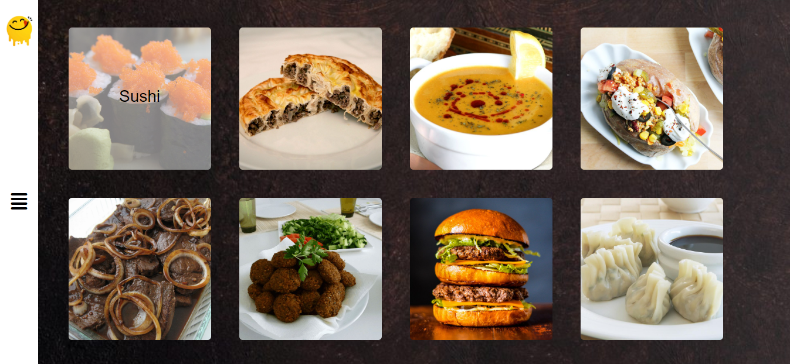
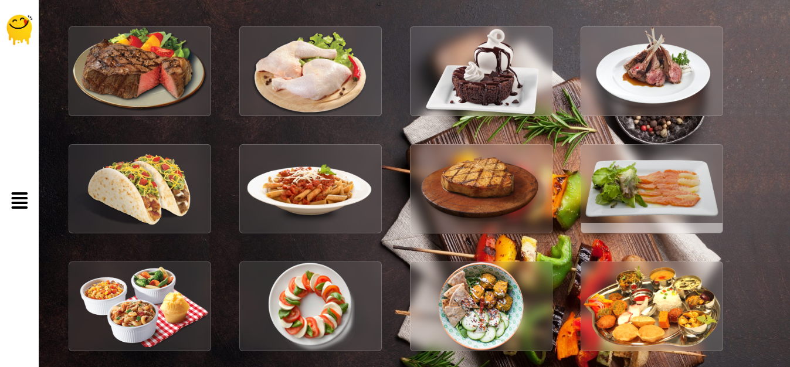
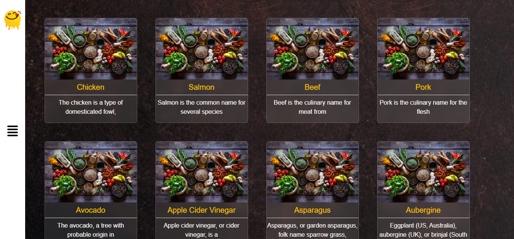
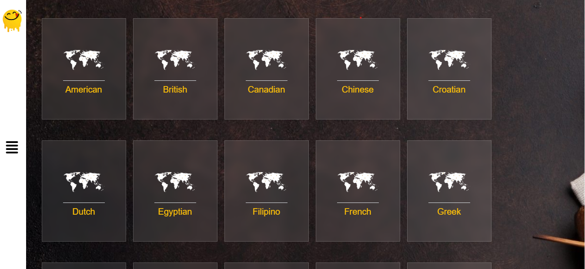
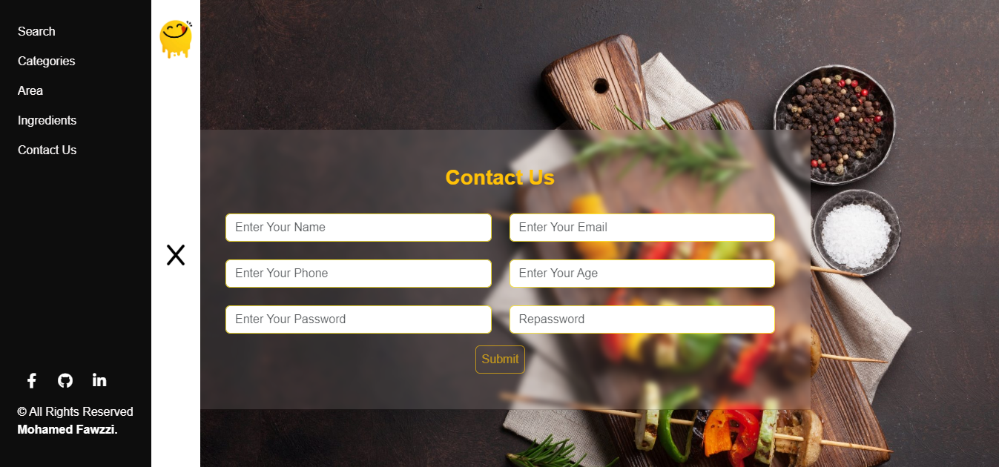
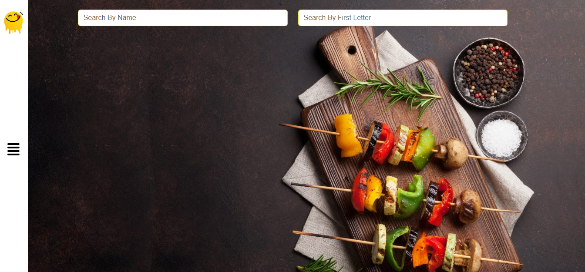

# Yummy

This is a simple recipe app designed to help you discover delicious recipes from various cuisines. Using TheMealDB API, you can search for recipes, view details, and find inspiration for your next meal.

## Features

- Search for recipes by name or ingredient.
- View detailed information about each recipe, including ingredients, instructions, and images.
- Responsive Design ensuring a great experience on all devices.

## Technologies Used

- HTML
- CSS
- Bootstrap
- Font Awesome
- JavaScript
- TheMealDB API([TheMealDB API](https://www.themealdb.com/api.php))

## Preview

## Live Demo

Check out the live demo [here](https://mohammed-fawzzi.github.io/Yummy/).
